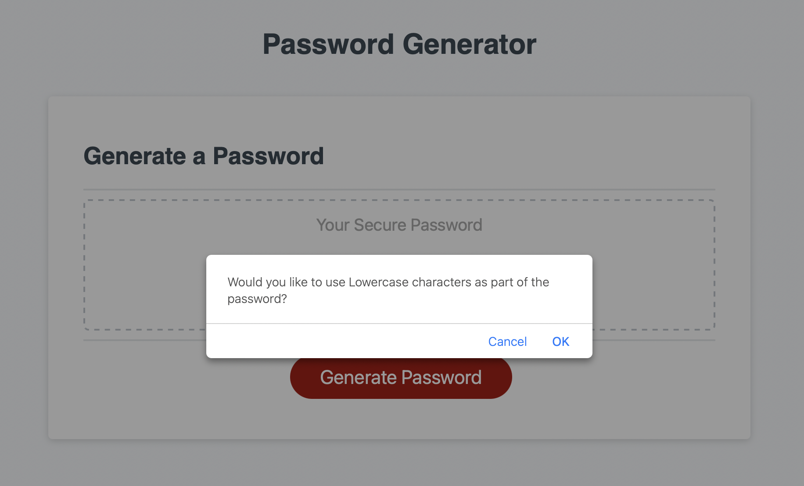

# PasswordGenerator

## Description

This project is to build a password generator that could randamly generate password according to user requirement.

## Installation

N/A

## Usage

visit application URL: https://benliu104.github.io/PasswordGenerator/

Step 1: Click on "Generate Password" button.

Step 2: Enter required password length.

Step 3: select the character type of combination for password according to the instrcution.

Step 4: Password will show up and you can just copy that.

## Credits

Ben Liu: https://github.com/BenLiu104

## License

Please refer to the LICENSE in the repo.

